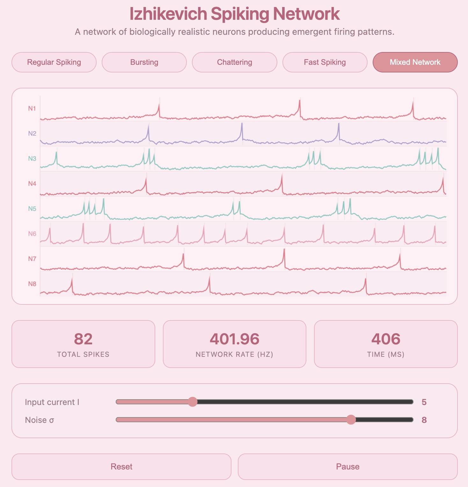

# Izhikevich Spiking Neuron Network

An interactive network of biologically realistic spiking neurons built from scratch using Vite and the Canvas API. Implements the Izhikevich neuron model — a two-variable dynamical system that reproduces over 20 distinct firing patterns observed in real cortical neurons — and renders a live multi-channel voltage trace for a network of 8 neurons.



## What is the Izhikevich Model?

The Izhikevich model, introduced by Eugene Izhikevich in 2003, strikes the optimal balance between biological plausibility and computational efficiency. Unlike the Hodgkin-Huxley model (four coupled differential equations, biophysically detailed but expensive), the Izhikevich model reduces neural dynamics to just two variables:

**dv/dt = 0.04v² + 5v + 140 − u + I**

**du/dt = a(bv − u)**

Where v is the membrane potential, u is a membrane recovery variable modelling the activation of K⁺ and inactivation of Na⁺ ionic currents, and I is the synaptic input current. When v reaches +30mV, a spike is registered and the system resets:

v ← c
u ← u + d

The four parameters (a, b, c, d) are tuned to reproduce distinct biological firing patterns:

| Pattern | a | b | c | d | Description |
|---|---|---|---|---|---|
| Regular Spiking (RS) | 0.02 | 0.2 | -65 | 8 | Most common cortical excitatory neuron |
| Intrinsic Bursting (IB) | 0.02 | 0.2 | -55 | 4 | Fires a burst then switches to regular |
| Chattering (CH) | 0.02 | 0.2 | -50 | 2 | High-frequency burst clusters |
| Fast Spiking (FS) | 0.1 | 0.2 | -65 | 2 | Cortical inhibitory interneuron |

## Features

- 8-neuron network with live multi-channel voltage raster display
- Four biologically named firing pattern modes — Regular Spiking, Bursting, Chattering, Fast Spiking
- Mixed Network mode assigns each neuron a random pattern type
- Each neuron type colour coded — pink, lavender, teal, soft rose
- Stochastic input noise σ simulates realistic synaptic variability
- Interactive sliders for input current I and noise level σ
- Live stats: total spike count, network firing rate in Hz, simulation time in ms
- Pause and resume at any point

## Install

```bash
git clone https://github.com/ruedaniels/izhikevich-network.git
cd izhikevich-network
npm install
npm run dev
```

Then open http://localhost:5173 in your browser.

## How to Use

- **Pattern buttons** — switch all neurons to a specific firing mode or mix them
- **Input current I** — increase to drive faster firing across the network
- **Noise σ** — add stochastic variability to simulate noisy synaptic input
- **Reset** — reinitialise all neurons with fresh parameters
- **Pause** — freeze the simulation to inspect the voltage traces

## How It Works

On each timestep (dt = 0.5ms), every neuron integrates its inputs using Euler's method:

dv = (0.04·v² + 5·v + 140 − u + I + noise) · dt
du = a · (b·v − u) · dt
v += dv
u += du
if v >= 30:
record spike
v = c
u = u + d

Voltage history is stored in a rolling 500-sample buffer per neuron and rendered as a continuous coloured trace. Spike events are marked as vertical lines within each neuron's row.

## Simplifications

- No synaptic connectivity between neurons — each neuron receives independent input
- Euler integration rather than Runge-Kutta — introduces small numerical error at large dt
- Fixed noise model — uniform random perturbation rather than Ornstein-Uhlenbeck process
- Membrane potential in arbitrary model units rather than calibrated millivolts

## Known Limitations

- No lateral inhibition or excitatory coupling between neurons
- Does not implement spike-frequency adaptation beyond what the u variable provides
- Mixed network mode assigns patterns randomly at reset rather than by cortical layer

## Tech Stack

- Vite
- Vanilla JavaScript
- HTML5 Canvas API

## References

- Izhikevich, E.M. (2003). Simple model of spiking neurons. *IEEE Transactions on Neural Networks*, 14(6), 1569–1572.
- Izhikevich, E.M. (2007). *Dynamical Systems in Neuroscience: The Geometry of Excitability and Bursting*. MIT Press.
- Hodgkin, A.L., & Huxley, A.F. (1952). A quantitative description of membrane current and its application to conduction and excitation in nerve. *Journal of Physiology*, 117(4), 500–544.